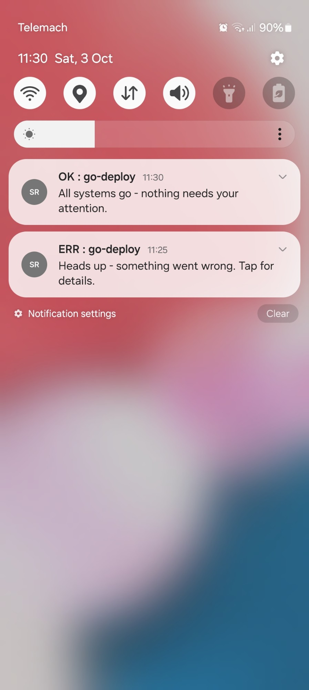
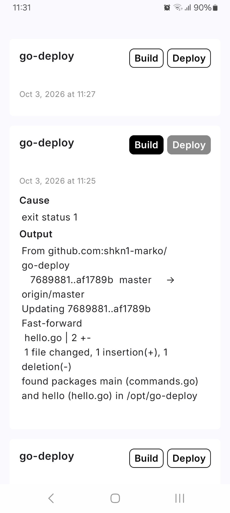

# StatRep

An Android app that shows build and deploy results from a [go-deploy](https://github.com/shkn1-marko/go-deploy) server as push notifications.

When go-deploy finishes a deployment, it sends a Firebase Cloud Messaging (FCM) message to every registered device. StatRep saves each result on the device with Room, shows it in a list, and posts a notification if the app is in the background.

<p align="center">
  
  &nbsp;&nbsp;&nbsp;&nbsp;
  
</p>

## Server integration

### Device registration

On startup the app sends:

```
POST {godeploy.baseUrl}/register-device
Content-Type: application/json
X-GDEP-Signature-256: sha256=<hex HMAC-SHA256 of the body using registerSecret>

{"installationID":"<FCM installation ID>"}
```

### Message format

go-deploy sends an FCM **data** message with these fields:

| Field          | Required | Description                                        |
| -------------- | -------- | -------------------------------------------------- |
| `name`         | yes      | Project or deployment name (cut to 50 characters)  |
| `buildStatus`  | yes      | `OK`, `FAILED`, or `SKIPPED`                       |
| `deployStatus` | yes      | `OK`, `FAILED`, or `SKIPPED`                       |
| `timestamp`    | yes      | Unix time in seconds                               |
| `cause`        | no       | Why it failed (cut to 500 characters)              |
| `output`       | no       | Command output (cut to 1500 characters)            |

The app ignores messages that are missing a required field or that have an invalid status value. A result counts as successful only when both `buildStatus` and `deployStatus` are `OK`.

## Setup

### Prerequisites

- Android Studio (a recent version that supports AGP 9.4)
- A Firebase project with Cloud Messaging enabled
- A running go-deploy server

### 1. Add Firebase config

Register an Android app with package name `com.shkn1marko.statrep` in your Firebase project. Download `google-services.json` and put it in the `app/` folder.

### 2. Set the go-deploy connection details

Add these lines to `local.properties` in the project root:

```properties
godeploy.baseUrl=http://your-server:port
godeploy.registerSecret=your-shared-secret
```

`registerSecret` has to match the secret your go-deploy server uses to check the `X-GDEP-Signature-256` header.

### 3. Add a network security config

The manifest points to `app/src/main/res/xml/network_security_config.xml`. That file is not in the repository because it contains your server address. Create it yourself. If your server uses plain HTTP, allow cleartext traffic to that host only:

```xml
<?xml version="1.0" encoding="utf-8"?>
<network-security-config>
    <domain-config cleartextTrafficPermitted="true">
        <domain includeSubdomains="false">your-server</domain>
    </domain-config>
</network-security-config>
```

### 4. Build and run

Open the project in Android Studio and run the `app` configuration. You can also build from the command line:

```bash
./gradlew assembleDebug
```
